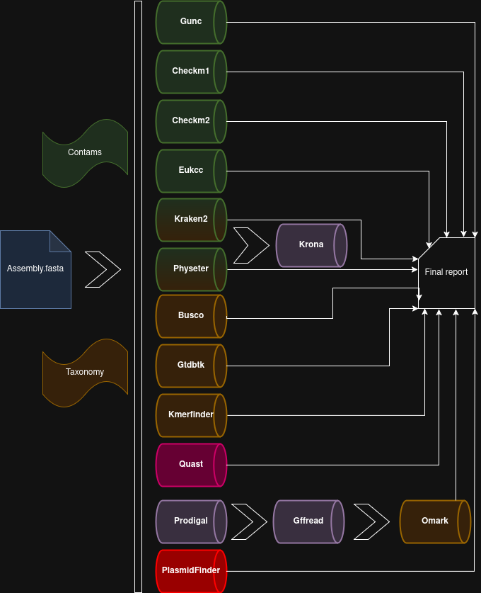

# BASTION

## Overview

**Bacterial ASsembly contaminaTION** is a nextflow pipeline allowing the automatic quality assemment of bacterial assembly. 

This project is largely inspired by the Genome quality assessment workflow from the **Genera** toolbox of Luc CORNET from the University of Liege: **https://github.com/Lcornet/GENERA.**

**Changement from original script :**
- Nextflow dsl2
- Slurm and Conda or singularity profiles
- Includes GTDBTK, Kmerfinder, Omark, PlasmidFinder tools
- Busco plots, Diamond plots from Gunc results and Krona from Kraken/Physeters results
- Annotation with Prodigal

## Quick start

1) Install **Nextflow**, **Singularity** (and Conda if desired).

2) `git clone https://github.com/alexisbourdais/Bastion/`

3) Change script permissions in **bin/** `chmod +x bin/*`

4) Create a directory **Data/** and add it assemblies to analysis or select a directory with `--assemblyDir` and format with `--format` (default: fasta)

5) Add depot image with `singularity remote add --no-login SylabsCloud cloud.sycloud.io` (if necessary, you can add this command to the .sh script before running `nexflow run`)

### Set-Up database (Over 200 Go of memory required)

- If you don't have any of the necessary databases, just run `nextflow run Bastion.nf -profile slurm,singularity --singularity "-B /root/to/mount:root/to/mount" --workflow setup --setAll --setGtdbtk` (GTDBTK database is not included in `--setAll`)
- if you have some database already installed, run `nextflow run Bastion.nf -profile slurm,singularity --workflow setup --setBusco --setKraken2` in order to install Busco (Prokaryota+virus) and Kraken2 (PlusPFP-16 version) database for exemple (see the list of commands for other databases below)
- If you have problems installing the gtdbtk database automatically due to its size (102 Go), download it manually : https://ecogenomics.github.io/GTDBTk/installing/index.html

### Run analysis

`nextflow run Bastion.nf -profile slurm,singularity --workflow analysis --singularity "-B /home:/home"`

or edit **Launcher_Bastion_analysis.sh**, then `chmod +x Launcher_Bastion_analysis.sh` and `./Launcher_Bastion_analysis.sh`

## Parameters

nextflow run Bastion.nf --help

    Command : nextflow run Bastion.nf -profile slurm,singularity [option] --workflow

    REQUIRED parameter

    -profile [standard]/slurm,      Select profile standard (local) or slurm. Default: standard          
             singularity/conda      Select profile singularity or conda. 
                                    Physeter and kraken's results treatment need singularity in both case and busco's conda env has mistakes.
    
    --workflow                      Select workflow :  'setup' to download database
                                                       'analysis' to run all analyses

    --singularity "-B /home:/home -B ..."    Path to mount, default: /home

    OPTIONAL parameter

    -resume                         used to resume a workflow from where it was previously stopped or interrupted

    Choose which database you want to set-up when using --workflow setup
    --setAll
    --setEukcc
    --setBusco
    --setGtdbtk
    --setKraken2
    --setKrona
    --setCheckm1
    --setGunc
    --setCheckm2
    --setPhyseter
    --setOmark
    --setKmerfinder
    --setPlasmidfinder

    Path to database directory : automatic if installed with --workflow setup
    --db_busco            Path to database directory
    --db_checkm2          Path to checkm2_uniref100.KO.1.dmnd
    --db_eukcc            Path to database directory
    --db_gunc             Path to gunc_db_progenomes2.1.dmnd
    --db_kraken2          Path to database directory
    --db_krona            Path to database directory
    --db_gtdbtk           Path to database directory
    --db_checkm1          Path to database directory
    --db_omark            Path to database directory
    --db_physeter         Path to life-tqmd-of73.dmnd
    --taxdump             Path to taxdump
    --db_kmerfinder       Path to database directory
    --db_plasmidfinder    Path to database directory

    Assembly directory
    --assemblyDir            Default: "./Data/"
    --format                 Default: "fasta"

    Results directory
    --resultsDir            Path to results directory, default: "Results/"

    Busco
    --lineage_busco         [auto-lineage], auto-lineage-prok, bacteria_odb10

    Physeter
    --taxlevel              [phylum]
    --automode              [label_first]

## Documentation

- Nextflow : https://www.nextflow.io/

- Singularity : https://sylabs.io/docs/

- Conda : https://docs.anaconda.com/miniconda/

- GENERA : https://github.com/Lcornet/GENERA

- Barrnap : https://github.com/tseemann/barrnap

- Busco : https://busco.ezlab.org/

- CheckM1 : https://github.com/Ecogenomics/CheckM/wiki

- CheckM2 : https://github.com/chklovski/CheckM2

- Eukcc2 : https://eukcc.readthedocs.io/en/latest/

- GTDBTK : https://ecogenomics.github.io/GTDBTk/

- Gffread : https://github.com/gpertea/gffread

- Gunc : https://grp-bork.embl-community.io/gunc/

- Kmerfinder : https://bitbucket.org/genomicepidemiology/kmerfinder/src/master/

- Kraken2 : https://github.com/DerrickWood/kraken2/wiki

- Krona : https://github.com/marbl/Krona
  
- OMArk : https://github.com/DessimozLab/OMArk

- Physeter :  https://metacpan.org/dist/Bio-MUST-Apps-Physeter/view/lib/Bio/MUST/Apps/Physeter/Manual.pod

- Plasmidfinder : https://github.com/genomicepidemiology/plasmidfinder

- Prodigal : https://github.com/hyattpd/Prodigal

- Quast : https://quast.sourceforge.net/docs/manual.html

## References

P. Di Tommaso, et al. Nextflow enables reproducible computational workflows. Nature Biotechnology 35, 316–319 (2017) doi:10.1038/nbt.3820

Kurtzer, Gregory M., Vanessa Sochat, et Michael W. Bauer. « Singularity: Scientific Containers for Mobility of Compute ». Édité par Attila Gursoy. PLOS ONE 12, n o 5 (11 mai 2017): e0177459. https://doi.org/10.1371/journal.pone.0177459.

Cornet L, Durieu B, Baert F, D’hooge E, Colignon D, Meunier L, Lupo V, Cleenwerck I, Daniel H-M, Rigouts L, Sirjacobs D, Declerck S, Vandamme P, Wilmotte A, Baurain D, Becker P (2022). The GEN-ERA toolbox: unified and reproducible workflows for research in microbial genomics. Submitted to GIGAscience

Mosè Manni, Matthew R Berkeley, Mathieu Seppey, Felipe A Simão, Evgeny M Zdobnov, BUSCO Update: Novel and Streamlined Workflows along with Broader and Deeper Phylogenetic Coverage for Scoring of Eukaryotic, Prokaryotic, and Viral Genomes.  Molecular Biology and Evolution, Volume 38, Issue 10, October 2021, Pages 4647–4654

Parks DH, Imelfort M, Skennerton CT, Hugenholtz P, Tyson GW. 2014. Assessing the quality of microbial genomes recovered from isolates, single cells, and metagenomes. Genome Research, 25: 1043-1055

Saary, Paul, Alex L. Mitchell, and Robert D. Finn. “Estimating the quality of eukaryotic genomes recovered from metagenomic analysis with EukCC.” Genome biology 21.1 (2020): 1-21.

Pierre-Alain Chaumeil, Aaron J Mussig, Philip Hugenholtz, Donovan H Parks, GTDB-Tk v2: memory friendly classification with the genome taxonomy database, Bioinformatics, Volume 38, Issue 23, 1 December 2022, Pages 5315–5316, https://doi.org/10.1093/bioinformatics/btac672

Orakov, A., Fullam, A., Coelho, L.P. et al. GUNC: detection of chimerism and contamination in prokaryotic genomes. Genome Biol 22, 178 (2021). https://doi.org/10.1186/s13059-021-02393-0

Wood, D.E., Lu, J. & Langmead, B. Improved metagenomic analysis with Kraken 2. Genome Biol 20, 257 (2019). https://doi.org/10.1186/s13059-019-1891-0

Ondov BD, Bergman NH, and Phillippy AM. Interactive metagenomic visualization in a Web browser. BMC Bioinformatics. 2011 Sep 30; 12(1):385.

OMArk, a tool for gene annotation quality control, reveals erroneous gene inference. Nat Biotechnol 43, 40–41 (2025). https://doi.org/10.1038/s41587-024-02155-w

Alla Mikheenko, Andrey Prjibelski, Vladislav Saveliev, Dmitry Antipov, Alexey Gurevich, Versatile genome assembly evaluation with QUAST-LG, Bioinformatics, Volume 34, Issue 13, July 2018, Pages i142–i150, https://doi.org/10.1093/bioinformatics/bty266

Benchmarking of Methods for Genomic Taxonomy. Larsen MV, Cosentino S, Lukjancenko O, Saputra D, Rasmussen S, Hasman H, Sicheritz-Pontén T, Aarestrup FM, Ussery DW, Lund O. J Clin Microbiol. 2014 Feb 26. [Epub ahead of print]

Hyatt, D., Chen, GL., LoCascio, P.F. et al. Prodigal: prokaryotic gene recognition and translation initiation site identification. BMC Bioinformatics 11, 119 (2010). https://doi.org/10.1186/1471-2105-11-119

PlasmidFinder and pMLST: in silico detection and typing of plasmids. Carattoli A, Zankari E, Garcia-Fernandez A, Volby Larsen M, Lund O, Villa L, Aarestrup FM, Hasman H. Antimicrob. Agents Chemother. 2014. April 28th
